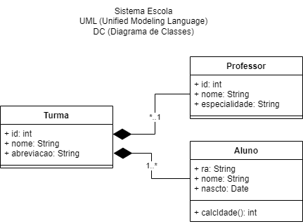
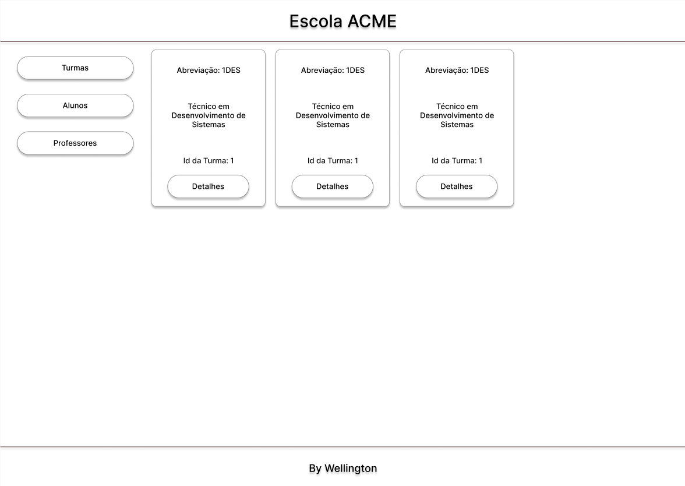
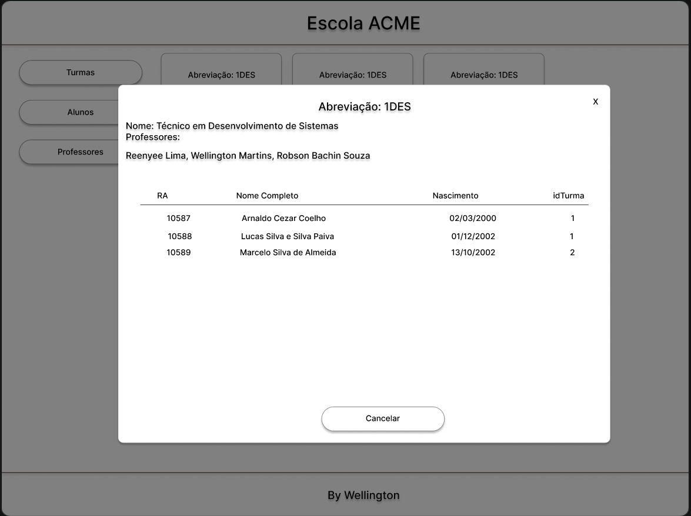
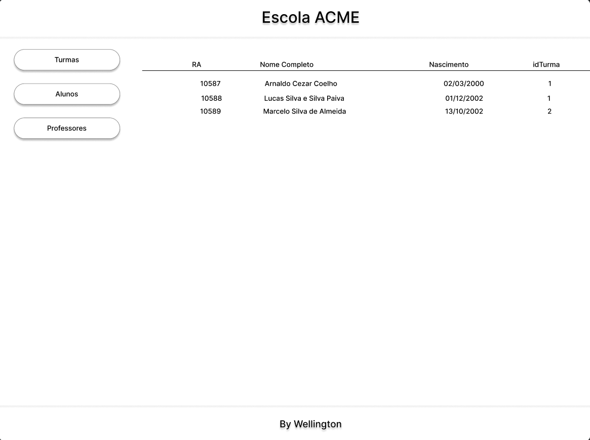
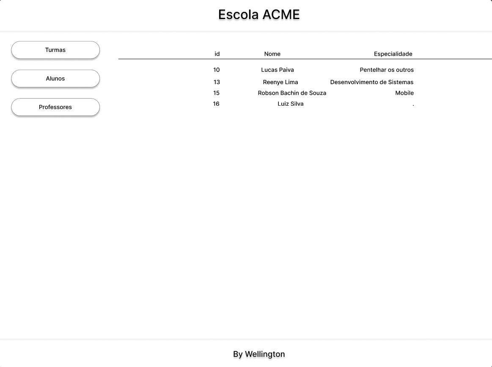

# Projeto Escola
Simples projeto backend integrado, exemplo de um fullstack integrado

|Tecnologias|
|-|
|NodeJS|
|Prisma|
|PUG|
|XAMPP MySQL|

## Documentação
### Diagrama de Classes

### MER DER

### Wireframes





## Para testar o projeto
- 1 Clone este repositório
- 2 Abra com o VsCode
- 3 Abra o terminal cmd ou bash instale as dependências
```bash
npm i
```
- 4 Configure o arquivo **.env** com a string a seguir:
```js
DATABASE_URL="mysql://root@localhost:3306/escola?schema=public&timezone=UTC"
```
- 5 Criar a migração, Abrir XAMPP e clicar em start em MySQL e Apache, e no teminal do VsCode executar o comando a seguir:
```bash
prisma migrate dev --name init
```